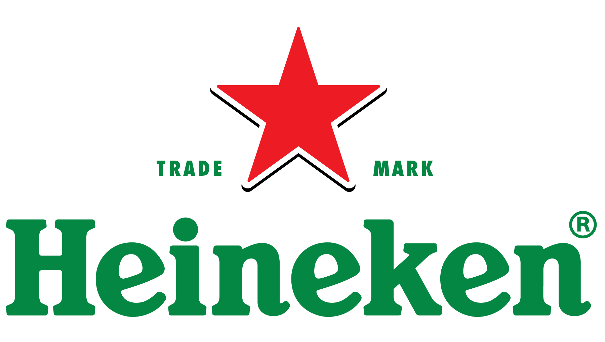

```{=html}
<header class="about-hero section-block" data-animate>
  <p class="about-hero__eyebrow">About</p>
  <h1 class="about-hero__title">I build ML systems that <em>actually ship</em>.</h1>
  <p class="about-hero__lede">
    Six years across fintech, a Latin American unicorn, and a global consumer brand — always on the data and ML side. I care about fast feedback loops, measurable outcomes, and code that people actually use in production.
  </p>
</header>

<section id="work" class="section-block" data-animate aria-labelledby="work-heading">
  <h2 id="work-heading" class="section-heading">Work</h2>
  <div class="timeline">

    <article class="timeline-entry">
      <div class="timeline-entry__header">
        
        <div>
          <p class="timeline-entry__company">Kueski <span class="timeline-entry__tag">Biggest BNPL Fintech in Mexico</span></p>
          <p class="timeline-entry__meta">Senior Data Scientist &nbsp;·&nbsp; March 2022 – Dec 2025</p>
        </div>
      </div>
      <p class="timeline-entry__body">
        I owned the full lifecycle of Kueski's production fraud prevention ML systems — from feature engineering and model training through deployment and ongoing monitoring. I re-engineered the definition of fraud itself, cutting false positives by 65% and reducing monthly fraud-related losses by 70%. I also introduced graph analysis to surface hidden connections between fraudulent users, adding a structural intelligence layer that static models alone couldn't capture.
      </p>
    </article>

    <article class="timeline-entry">
      <div class="timeline-entry__header">
        
        <div>
          <p class="timeline-entry__company">Heineken <span class="timeline-entry__tag">Global CPG · B2B E-commerce</span></p>
          <p class="timeline-entry__meta">Growth Data Scientist &nbsp;·&nbsp; May 2021 – March 2022</p>
        </div>
      </div>
      <p class="timeline-entry__body">
        Heineken had just launched a B2B e-commerce platform and needed someone to turn data into decisions. I designed and ran an experiment on a subscription business model that produced a 16% revenue increase. I also built an NLP pipeline to classify and route customer reviews, compressing what used to be a two-week manual process into under two minutes — and led educational sessions across non-technical stakeholders to build data literacy at scale.
      </p>
    </article>

    <article class="timeline-entry">
      <div class="timeline-entry__header">
        
        <div>
          <p class="timeline-entry__company">Rappi <span class="timeline-entry__tag">Unicorn · On-demand Super App</span></p>
          <p class="timeline-entry__meta">Growth Data Scientist &nbsp;·&nbsp; Nov 2020 – May 2021</p>
        </div>
      </div>
      <p class="timeline-entry__body">
        At Rappi I focused on the marketing side of growth — building the attribution model that gave the team clear visibility into channel ROI and guiding spend allocation across media. I ran a series of A/B tests evaluating media vendors, creatives, and placements, using causal impact analysis to give the marketing team a rigorous way to assess performance beyond last-click assumptions.
      </p>
    </article>

  </div>
</section>

<section id="education" class="section-block" data-animate aria-labelledby="edu-heading">
  <h2 id="edu-heading" class="section-heading">Education</h2>
  <div class="edu-list">
    <div class="edu-item">
      <p class="edu-item__degree">Master of Data Science</p>
      <p class="edu-item__school">University of British Columbia · Vancouver, BC · 2025–2026</p>
    </div>
    <div class="edu-item">
      <p class="edu-item__degree">Data Science &amp; Machine Learning Certification</p>
      <p class="edu-item__school">Massachusetts Institute of Technology · 2022</p>
    </div>
    <div class="edu-item">
      <p class="edu-item__degree">Bachelor of Actuarial Sciences</p>
      <p class="edu-item__school">Universidad Nacional Autónoma de México · Mexico City · 2020</p>
    </div>
  </div>
</section>

<section id="approach" class="section-block" data-animate aria-labelledby="approach-heading">
  <h2 id="approach-heading" class="section-heading">How I work</h2>
  <div class="now-card">
    I favor fast feedback loops and iterative delivery over big-bang projects. My instinct is to ship something high-value early, measure it, and improve — rather than spend months building in isolation. I blend analytical rigor with startup speed, and I'm always thinking about the business problem behind the technical one. If a model doesn't make someone's job easier or a metric better, it's not done yet.
  </div>
</section>

<section id="connect" class="section-block" data-animate aria-labelledby="connect-heading">
  <h2 id="connect-heading" class="section-heading">Get in touch</h2>
  <p class="section-lede">Open to interesting problems. Find me on <a href="https://www.linkedin.com/in/el%C3%AD-gonz%C3%A1lez-zequeida/" target="_blank" rel="noopener noreferrer">LinkedIn</a> or read my work on <a href="https://medium.com/@eligoze75" target="_blank" rel="noopener noreferrer">Medium</a>.</p>
</section>

<script>
(function () {
  var nodes = document.querySelectorAll("[data-animate]");
  var reduceMotion = window.matchMedia("(prefers-reduced-motion: reduce)").matches;
  if (reduceMotion) { nodes.forEach(function (el) { el.classList.add("is-visible"); }); return; }
  if (!nodes.length || !("IntersectionObserver" in window)) {
    nodes.forEach(function (el) { el.classList.add("is-visible"); }); return;
  }
  var io = new IntersectionObserver(function (entries) {
    entries.forEach(function (e) {
      if (e.isIntersecting) { e.target.classList.add("is-visible"); io.unobserve(e.target); }
    });
  }, { rootMargin: "0px 0px -8% 0px", threshold: 0.08 });
  nodes.forEach(function (el) { io.observe(el); });
})();
</script>
```
