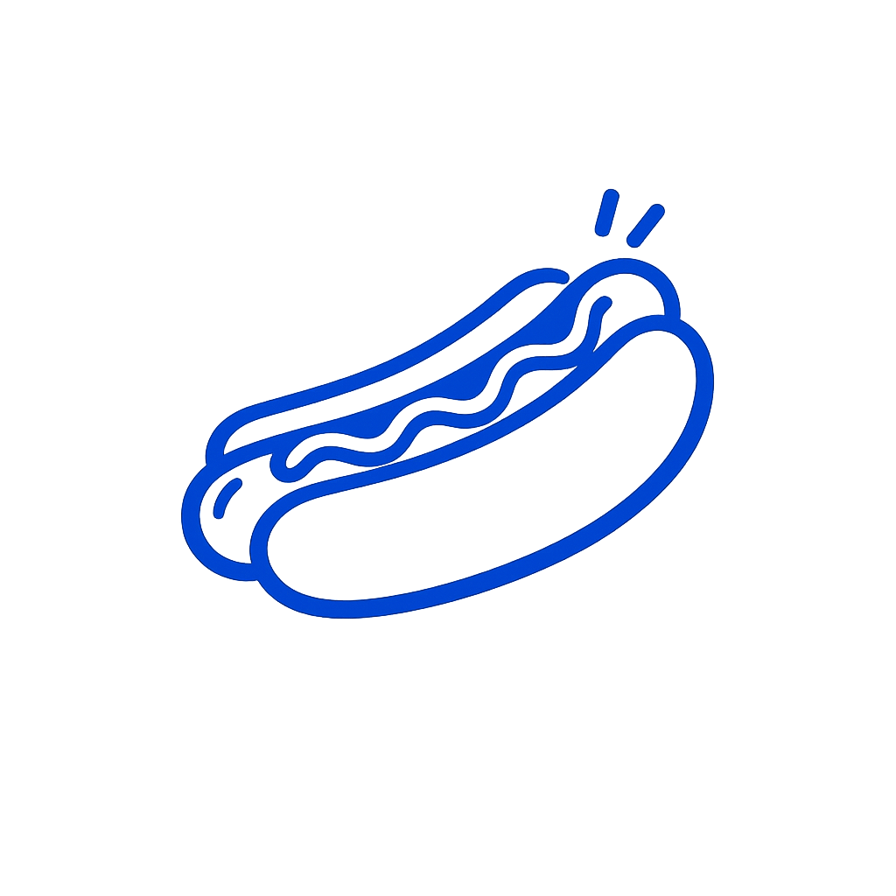

```{=html}
<header class="hero section-block" data-animate>
  <div class="hero__inner">
    
    <div class="hero__copy">
      <p class="hero__title" role="heading" aria-level="1">I'm Elí</p>
      <p class="hero__role">Data scientist &amp; builder</p>
      <p class="hero__lede">
        6 years building production ML at fintech companies, unicorn startups, and global brands. I co-founded a ghost kitchen powered by data analytics, shipped open source tools to PyPI, and write about machine learning on Medium. Currently a Master of Data Science candidate at UBC, going deep on AI systems and real-world product problems.
      </p>
      <div class="hero__actions">
        <a class="btn btn--primary" href="https://medium.com/@eligoze75" target="_blank" rel="noopener noreferrer">Data science blog</a>
        <a class="btn btn--ghost" href="https://www.linkedin.com/in/el%C3%AD-gonz%C3%A1lez-zequeida/" target="_blank" rel="noopener noreferrer">LinkedIn</a>
      </div>
    </div>
  </div>
</header>

<section id="experience" class="section-block" data-animate aria-labelledby="experience-heading">
  <h2 id="experience-heading" class="section-heading">Where I've worked</h2>
  <p class="section-lede">Startups, unicorns, and a global brand. Always on the data and ML side.</p>
  <div class="exp-strip">

    <div class="exp-card">
      
      <div class="exp-card__body">
        <p class="exp-card__company">Kueski</p>
        <p class="exp-card__role">Senior Data Scientist</p>
        <p class="exp-card__domain">Fintech · Fraud &amp; Risk</p>
      </div>
    </div>

    <div class="exp-card">
      
      <div class="exp-card__body">
        <p class="exp-card__company">Rappi</p>
        <p class="exp-card__role">Growth Data Scientist</p>
        <p class="exp-card__domain">Unicorn On-demand Delivery · Growth</p>
      </div>
    </div>

    <div class="exp-card">
      
      <div class="exp-card__body">
        <p class="exp-card__company">Heineken</p>
        <p class="exp-card__role">Growth Data Scientist</p>
        <p class="exp-card__domain">CPG · B2B E-commerce · Growth</p>
      </div>
    </div>

    <div class="exp-card">
      
      <div class="exp-card__body">
        <p class="exp-card__company">Insaite</p>
        <p class="exp-card__role">Data Science Sales Engineer</p>
        <p class="exp-card__domain">AI as a Service · Strategy &amp; Consulting</p>
      </div>
    </div>

    <div class="exp-card">
      
      <div class="exp-card__body">
        <p class="exp-card__company">Axity</p>
        <p class="exp-card__role">Junior Data Scientist</p>
        <p class="exp-card__domain">Digital Transformation Firm · Consulting</p>
      </div>
    </div>

  </div>
</section>

<section id="projects" class="section-block section-block--tight" data-animate aria-labelledby="projects-heading">
  <h2 id="projects-heading" class="section-heading">Projects</h2>
  <p class="section-lede">Selected work. Tools and dashboards I've shipped or maintain.</p>
  <div class="project-grid">
    <a class="project-card" href="https://pypi.org/project/megumi/" target="_blank" rel="noopener noreferrer">
      <div class="project-card__row">
        
        <div class="project-card__head">
          <h3 class="project-card__title">Megumi</h3>
          <p class="project-card__meta"><span class="project-card__tag">Open source</span><span class="project-card__dot" aria-hidden="true">·</span><span>Python · PyPI</span></p>
        </div>
      </div>
      <p class="project-card__desc">Feature engineering utilities for ML workflows, packaged for reuse across projects.</p>
      <span class="project-card__cta">View on PyPI <span aria-hidden="true">→</span></span>
    </a>
    <a class="project-card" href="https://859f9c80-f35f-4f6b-9d73-70e74c5e85e2.plotly.app/" target="_blank" rel="noopener noreferrer">
      <div class="project-card__row">
        
        <div class="project-card__head">
          <h3 class="project-card__title">Canada Food Pulse</h3>
          <p class="project-card__meta"><span class="project-card__tag">Dashboard</span><span class="project-card__dot" aria-hidden="true">·</span><span>Plotly Dash · Yelp</span></p>
        </div>
      </div>
      <p class="project-card__desc">Interactive map of Canada's food scene from public Yelp data. Explore cities and categories.</p>
      <span class="project-card__cta">Open live app <span aria-hidden="true">→</span></span>
    </a>
    <div class="project-card project-card--featured">
      <div class="project-card__logo-row">
        
        
        
      </div>
      <div class="project-card__head">
        <h3 class="project-card__title">Ghost Kitchen — MunchGo, WingsEat &amp; Munchin' Dogs</h3>
        <p class="project-card__meta">
          <span class="project-card__tag">Founder</span>
          <span class="project-card__dot" aria-hidden="true">·</span>
          <span>Data-driven · Mexico City · Food Tech</span>
        </p>
      </div>
      <p class="project-card__desc">
        Co-founded and scaled a data-driven ghost kitchen in Mexico City operating three virtual restaurant brands across brunch, wings, and hot dogs. Used Yelp and HERE Maps data to identify market gaps, benchmark competitors, analyze customer review patterns, and find optimal pricing. This turned raw location and review data into operational decisions that shaped the menu, branding, and acquisition strategy.
      </p>
      <span class="project-card__cta">Founder &amp; operator <span aria-hidden="true">→</span></span>
    </div>
  </div>
</section>

<section id="stack" class="section-block" data-animate aria-labelledby="stack-heading">
  <h2 id="stack-heading" class="section-heading">Stack</h2>
  <p class="section-lede">Technologies and domains I work in regularly.</p>
  <div class="skill-chips">
    <span class="skill-chip">Python</span>
    <span class="skill-chip">SQL</span>
    <span class="skill-chip">Scikit-learn</span>
    <span class="skill-chip">Plotly Dash</span>
    <span class="skill-chip">PyPI / open source</span>
    <span class="skill-chip">Machine Learning</span>
    <span class="skill-chip">Fraud &amp; Risk</span>
    <span class="skill-chip">A/B Testing</span>
    <span class="skill-chip">NLP</span>
    <span class="skill-chip">UBC MDS</span>
  </div>
</section>

<section id="now" class="section-block" data-animate aria-labelledby="now-heading">
  <h2 id="now-heading" class="section-heading">Right now</h2>
  <div class="now-card">
    <div class="now-card__inner">
      
      <p style="margin:0;">Pursuing my Master of Data Science at UBC. Focused on ML systems, LLM applications, and production analytics.</p>
    </div>
  </div>
</section>

<script>
(function () {
  var nodes = document.querySelectorAll("[data-animate]");
  var reduceMotion = window.matchMedia("(prefers-reduced-motion: reduce)").matches;
  if (reduceMotion) {
    nodes.forEach(function (el) { el.classList.add("is-visible"); });
    return;
  }
  if (!nodes.length || !("IntersectionObserver" in window)) {
    nodes.forEach(function (el) { el.classList.add("is-visible"); });
    return;
  }
  var io = new IntersectionObserver(
    function (entries) {
      entries.forEach(function (e) {
        if (e.isIntersecting) {
          e.target.classList.add("is-visible");
          io.unobserve(e.target);
        }
      });
    },
    { rootMargin: "0px 0px -8% 0px", threshold: 0.08 }
  );
  nodes.forEach(function (el) { io.observe(el); });
})();
</script>
```
