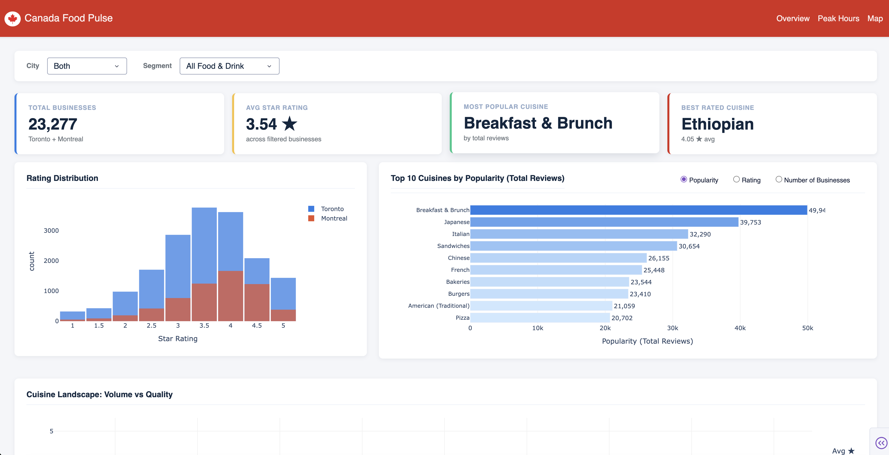

```{=html}
<header class="hero section-block" data-animate>
  <div class="hero__inner">
    
    <div class="hero__copy">
      <p class="hero__title" role="heading" aria-level="1">I'm Elí</p>
      <p class="hero__role">Data scientist &amp; builder</p>
      <p class="hero__lede">
        I'm a Vancouver-based data scientist with 6+ years shipping production ML in fraud, growth, and analytics. I like fast feedback loops, clear metrics, and tools that teams actually use. I'm also pursuing my Master of Data Science at UBC.
      </p>
      <div class="hero__actions">
        <a class="btn btn--primary" href="https://medium.com/@eligoze75" target="_blank" rel="noopener noreferrer">Data science blog</a>
        <a class="btn btn--ghost" href="https://www.linkedin.com/in/el%C3%AD-gonz%C3%A1lez-zequeida/" target="_blank" rel="noopener noreferrer">LinkedIn</a>
      </div>
    </div>
  </div>
</header>

<section id="experience" class="section-block" data-animate aria-labelledby="experience-heading">
  <h2 id="experience-heading" class="section-heading">Where I've worked</h2>
  <p class="section-lede">Startups, unicorns, and a global brand — always on the data and ML side.</p>
  <div class="exp-strip">

    <div class="exp-card">
      
      <div class="exp-card__body">
        <p class="exp-card__company">Kueski</p>
        <p class="exp-card__role">Senior Data Scientist</p>
        <p class="exp-card__domain">Fintech · Fraud &amp; Risk · Mexico</p>
        <p class="exp-card__blurb">End-to-end owner of production fraud ML systems at the biggest BNPL lender in Latin America. Delivered a 70% reduction in monthly fraud losses.</p>
      </div>
    </div>

    <div class="exp-card">
      
      <div class="exp-card__body">
        <p class="exp-card__company">Rappi</p>
        <p class="exp-card__role">Growth Data Scientist</p>
        <p class="exp-card__domain">Super App · Growth &amp; Attribution · Unicorn</p>
        <p class="exp-card__blurb">Drove marketing spend decisions through attribution modeling and A/B testing at one of Latin America's largest on-demand platforms.</p>
      </div>
    </div>

    <div class="exp-card">
      
      <div class="exp-card__body">
        <p class="exp-card__company">Heineken</p>
        <p class="exp-card__role">Growth Data Scientist</p>
        <p class="exp-card__domain">CPG · B2B E-commerce · Experimentation</p>
        <p class="exp-card__blurb">Enabled data-driven growth on a newly launched B2B e-commerce platform — ran subscription experiments that lifted revenue 16% and built an NLP pipeline that cut Ops review time from two weeks to under two minutes.</p>
      </div>
    </div>

  </div>
</section>

<section id="projects" class="section-block section-block--tight" data-animate aria-labelledby="projects-heading">
  <h2 id="projects-heading" class="section-heading">Projects</h2>
  <p class="section-lede">Selected work — tools and dashboards I've shipped or maintain.</p>
  <div class="project-grid">
    <a class="project-card" href="https://pypi.org/project/megumi/" target="_blank" rel="noopener noreferrer">
      <div class="project-card__row">
        
        <div class="project-card__head">
          <h3 class="project-card__title">Megumi</h3>
          <p class="project-card__meta"><span class="project-card__tag">Open source</span><span class="project-card__dot" aria-hidden="true">·</span><span>Python · PyPI</span></p>
        </div>
      </div>
      <p class="project-card__desc">Feature engineering utilities for ML workflows, packaged for reuse across projects.</p>
      <span class="project-card__cta">View on PyPI <span aria-hidden="true">→</span></span>
    </a>
    <a class="project-card" href="https://859f9c80-f35f-4f6b-9d73-70e74c5e85e2.plotly.app/" target="_blank" rel="noopener noreferrer">
      <div class="project-card__row">
        
        <div class="project-card__head">
          <h3 class="project-card__title">Canada Food Pulse</h3>
          <p class="project-card__meta"><span class="project-card__tag">Dashboard</span><span class="project-card__dot" aria-hidden="true">·</span><span>Plotly Dash · Yelp</span></p>
        </div>
      </div>
      <p class="project-card__desc">Interactive map of Canada's food scene from public Yelp data — explore cities and categories.</p>
      <span class="project-card__cta">Open live app <span aria-hidden="true">→</span></span>
    </a>
  </div>
</section>

<section id="stack" class="section-block" data-animate aria-labelledby="stack-heading">
  <h2 id="stack-heading" class="section-heading">Stack</h2>
  <p class="section-lede">Technologies and domains I work in regularly.</p>
  <div class="skill-chips">
    <span class="skill-chip">Python</span>
    <span class="skill-chip">SQL</span>
    <span class="skill-chip">Scikit-learn</span>
    <span class="skill-chip">Plotly Dash</span>
    <span class="skill-chip">PyPI / open source</span>
    <span class="skill-chip">Machine Learning</span>
    <span class="skill-chip">Fraud &amp; Risk</span>
    <span class="skill-chip">A/B Testing</span>
    <span class="skill-chip">NLP</span>
    <span class="skill-chip">UBC MDS</span>
  </div>
</section>

<section id="now" class="section-block" data-animate aria-labelledby="now-heading">
  <h2 id="now-heading" class="section-heading">Right now</h2>
  <div class="now-card">
    Pursuing my Master of Data Science at UBC — focused on ML systems, LLM applications, and production analytics.
  </div>
</section>

<script>
(function () {
  var nodes = document.querySelectorAll("[data-animate]");
  var reduceMotion = window.matchMedia("(prefers-reduced-motion: reduce)").matches;
  if (reduceMotion) {
    nodes.forEach(function (el) { el.classList.add("is-visible"); });
    return;
  }
  if (!nodes.length || !("IntersectionObserver" in window)) {
    nodes.forEach(function (el) { el.classList.add("is-visible"); });
    return;
  }
  var io = new IntersectionObserver(
    function (entries) {
      entries.forEach(function (e) {
        if (e.isIntersecting) {
          e.target.classList.add("is-visible");
          io.unobserve(e.target);
        }
      });
    },
    { rootMargin: "0px 0px -8% 0px", threshold: 0.08 }
  );
  nodes.forEach(function (el) { io.observe(el); });
})();
</script>
```
